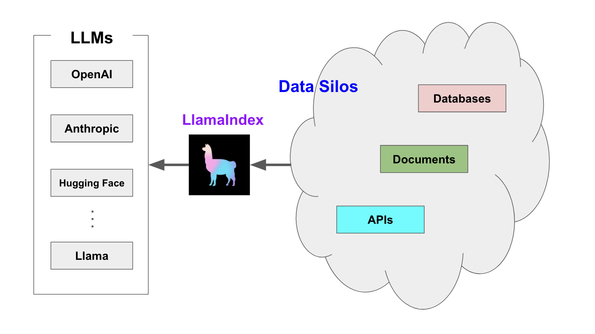
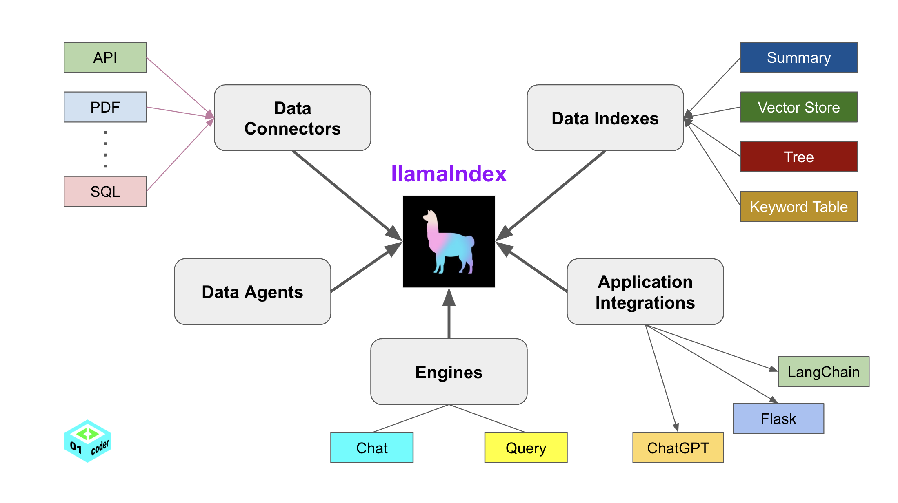

# 什么是LlamaIndex

`LlamaIndex` 是一个用于 `LLM` 应用程序的数据框架，用于注入，结构化，并访问私有或特定领域数据。

## LlamaIndex为何而生？

在本质上，`LLM`（如`GPT`）为人类和推断出的数据提供了基于自然语言的交互接口。广泛可用的大模型通常在大量公开可用的数据上进行的预训练，包括来自维基百科、邮件列表、书籍和源代码等。

构建在LLM模型之上的应用程序通常需要使用私有或特定领域数据来增强这些模型。不幸的是，这些数据可能分布在不同的应用程序和数据存储中。它们可能存在于API之后、SQL数据库中，或者存在在PDF文件以及幻灯片中。

LlamaIndex应运而生。

## LlamaIndex如何破局？

`LlamaIndex` 提供了5大核心工具：
- Data connectors
- Data indexes
- Engines
- Data agents
- Application integrations

## 一个简单的LlamaIndex应用

[01_Introduction.ipynb](./01_Introduction.ipynb)