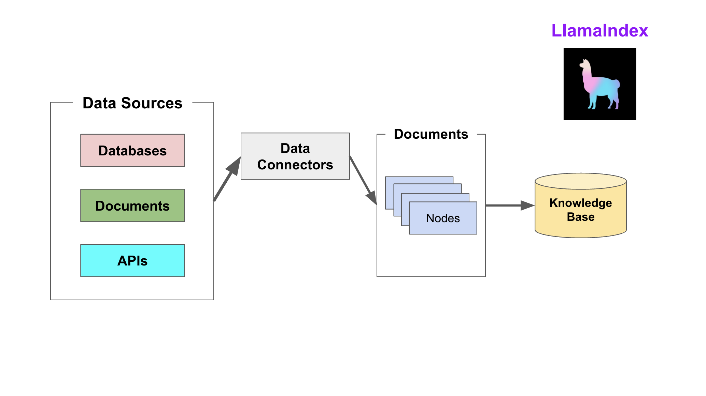
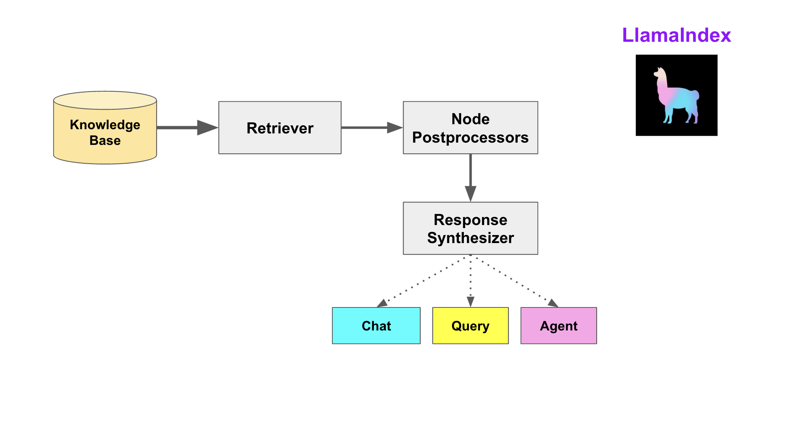

# 核心概念

`LlamaIndex` 帮助构建 `LLM` 驱动的，基于个人或私域数据的应用。RAG(Retrieval Augmented Generation) 是 `LlamaIndex` 应用的核心概念。

## RAG

RAG，也称为检索增强生成，是利用个人或私域数据增强 `LLM` 的一种范式。通常，它包含两个阶段：
1. 索引

    构建知识库。

2. 查询

    从知识库检索相关上下文信息，以辅助 `LLM` 回答问题。

`LlamaIndex` 提供了工具包帮助开发者极其便捷地完成这两个阶段的工作。

### 索引阶段

`LlamaIndex` 通过提供 Data connectors(数据连接器) 和 Indexes (索引) 帮助开发者构建知识库。

该阶段会用到如下工具或组件：

- Data connectors

    数据连接器。它负责将来自不同数据源的不同格式的数据注入，并转换为 `LlamaIndex` 支持的文档（Document）表现形式，其中包含了文本和元数据。

- Documents / Nodes

    Document是 `LlamaIndex` 中容器的概念，它可以包含任何数据源，包括，PDF文档，API响应，或来自数据库的数据。

    Node是 `LlamaIndex` 中数据的最小单元，代表了一个 Document的分块。它还包含了元数据，以及与其他Node的关系信息。这使得更精确的检索操作成为可能。

- Data Indexes

    `LlamaIndex` 提供便利的工具，帮助开发者为注入的数据建立索引，使得未来的检索简单而高效。

    最常用的索引是向量存储索引 - `VectorStoreIndex`。

### 查询阶段

在查询阶段，`RAG` 管道根据的用户查询，检索最相关的上下文，并将其与查询一起，传递给 `LLM`，以合成响应。这使 `LLM` 能够获得不在其原始训练数据中的最新知识，同时也减少了虚构内容。该阶段的关键挑战在于检索、编排和基于知识库的推理。

`LlamaIndex` 提供可组合的模块，帮助开发者构建和集成 `RAG` 管道，用于问答、聊天机器人或作为代理的一部分。这些构建块可以根据排名偏好进行定制，并组合起来，以结构化的方式基于多个知识库进行推理。

该阶段的构建块包括：

- Retrievers

    检索器。它定义如何高效地从知识库，基于查询，检索相关上下文信息。

- Node Postprocessors

    Node后处理器。它对一系列文档节点（Node）实施转换，过滤，或排名。

- Response Synthesizers

    响应合成器。它基于用户的查询，和一组检索到的文本块（形成上下文），利用 `LLM` 生成响应。

RAG管道包括：
- Query Engines

    查询引擎 - 端到端的管道，允许用户基于知识库，以自然语言提问，并获得回答，以及相关的上下文。

- Chat Engines

    聊天引擎 - 端到端的管道，允许用户基于知识库进行对话（多次交互，会话历史）。

- Agents

    代理。它是一种由 `LLM` 驱动的自动化决策器。代理可以像查询引擎或聊天引擎一样使用。主要区别在于，代理动态地决定最佳的动作序列，而不是遵循预定的逻辑。这为其提供了处理更复杂任务的额外灵活性。

